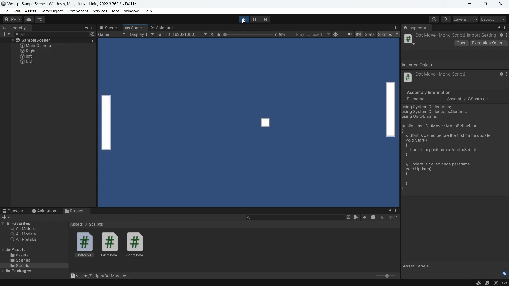
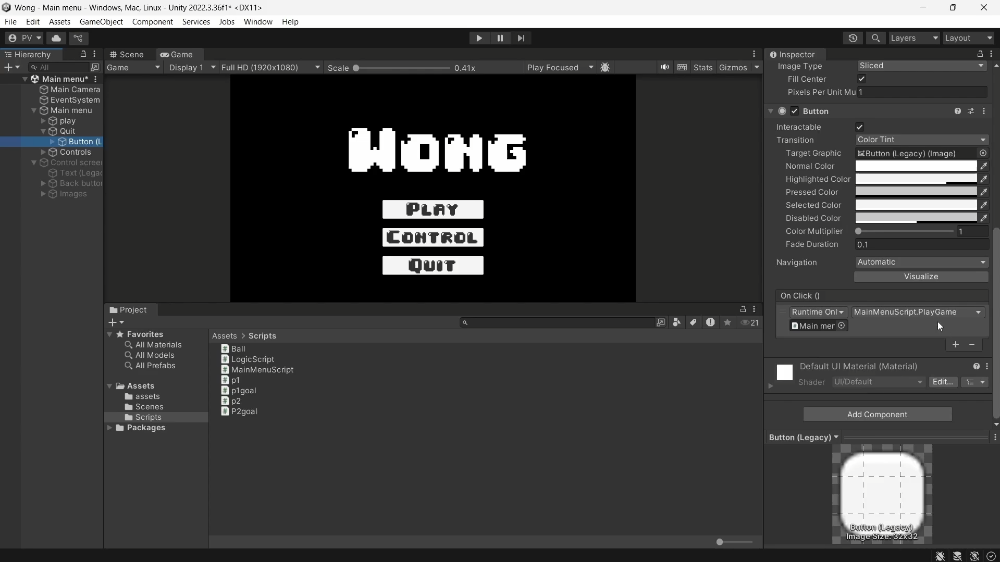
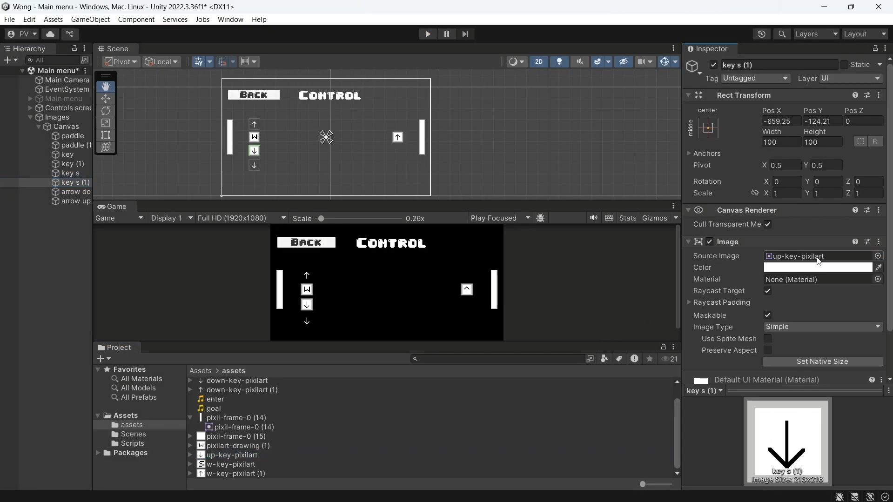
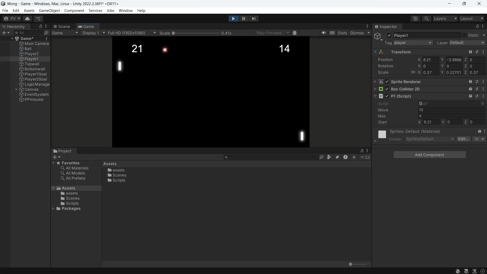

# My completely original masterpeice which was way behind my time

With having done flappy bird, i decided to move on and butcher another classic in the name of science. This time i tried making pong. 

<h4> What i learned in this project </h4>
<ul>
  <li>handling objects that collide constantly</li>
  <li>boundary checking</li>
  <li>having fun playing playing it with my friends</li>
</ul>

<b> Feast your eyes on my original creating :</b>

